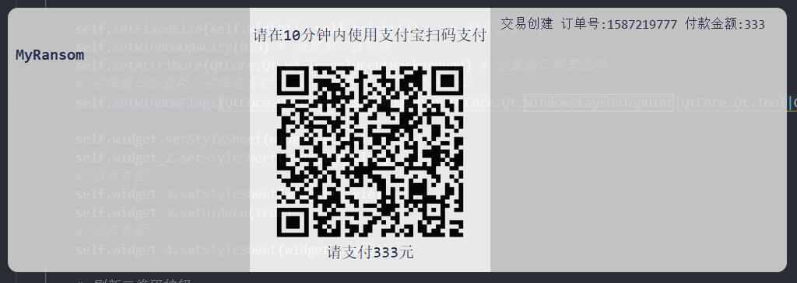

<p align="center">
  <a href="https://github.com/entropy2333/MyRansom">
    
  </a>
</p>

## MyRansom

Homework of the Virus Curriculum

## Requirments

- Python3
- Flask
- Vue.js

## Run the code

### Client

```sh
cd client
pip install -r requirements.txt
python pay.py
```

### Server

```sh
cd server/flask
pip install -r requirements.txt
python app.py
```

### Front-end

```sh
cd server/front-end
npm install
npm run serve
```

## License

## Contributors

dxr sck zhd yjt